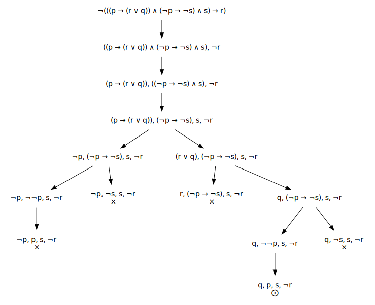

# Resolución en el Cálculo Proposicional

Este repositorio contiene el código de un programa de terminal diseñado para resolver problemas de lógica proposicional. Concretamente, construcción de **tableros semanticos** y **resolución** de expresiones de lógica proposicional.

## Motivación

Los problemas que intenta resolver este programa son problemas planteados en el Tema 1 de la asignatura [Conocimiento y Razonamiento Automatizado](https://www.uah.es/es/estudios/estudios-oficiales/grados/asignatura/Conocimiento-y-Razonamiento-Automatizado-780025/) del tercer curso del [Grado en Ingeniería Informática](https://www.uah.es/es/estudios/Grado-en-Ingenieria-Informatica/) de la [Universidad de Alcalá](https://www.uah.es/es/). Así pues, este programa intenta facilitar el estudio de esta asignatura proporcionando una herramienta para encontrar las soluciones de los problemas de manera consistente.

## Instalación

Este repositorio es un proyecto de [IntelliJ IDEA](https://www.jetbrains.com/es-es/idea/). Este tiene configurado un artefacto para crear un fichero **jar** que pueda utilizarse para ejecutar el programa. Se puede encontrar el fichero compilado para distintas versiones del jdk en el apartado de **releases** del repositorio.

### Compilación

Para compilarlo es necesario tener en la carpeta de dependencias el .jar con la librería [ANTLR v4](https://www.antlr.org/). La versión con la que se han creado los ficheros de la gramática es la **4.11.1** por lo que el fichero necesario sería [antlr-runtime-4.11.1.jar](https://www.antlr.org/download/antlr-runtime-4.11.1.jar). Sin embargo, es posible hacer que el programa funcione con otras versiones de [ANTLR v4](https://www.antlr.org/) siempre y cuando se vuelvan a generar los archivos de código a partir de la gramática en el paquete **calcprop.interpreter** del proyecto.

Una vez tenemos el código del programa y las dependencias correspondientes podemos compilarlo desde el menú `Build > Build Artifact... > SemanticTables:jar Build`. También se puede encontrar el fichero compilado para distintas versiones del jdk en el apartado de **releases** del repositorio.

### Programas necesarios

Además del fichero compilado, para algunas opciones del programa se necesitará tener instalado y en el PATH el programa [GraphViz](https://graphviz.org/). Este programa se utiliza para generar imagenes vectoriales de los tableros semánticos.

## Uso

Para utilizar el programa desde la terminal escribiremos algo similar a lo siguiente:

```bash
java -jar RCP-XX.jar <modo> <archivo>
```

En el anterior comando:

- `<modo>`. Puede tomar uno de los siguientes valores: `tablero-semantico`, `resolucion`.
- `<archivo>`. Es la ruta del archivo que contiene la formula a procesar.

El archivo que debemos pasar como segundo argumento al programa deberá contener una expresión de lógica proposicional utilizando los siguientes operadores:

- `¬`. Operador NOT.
- `∨`. Operador OR.
- `∧`. Operador AND.
- `→`. Operador Condicional.
- `↔`. Operador Bicondicional.
- `⊕`. Operador XOR.
- `|`. Operador NAND.
- `↓`. Operador NOR.

También se permite el uso de paréntesis para agrupar expresiones y `;` para crear comentarios de línea.

El programa solamente aceptará una expresión por archivo por lo que en el siguiente fichero de ejemplo:

```
¬(((p → (r ∨ q)) ∧ (¬p → ¬s) ∧ s) → r)
¬(((p → q) → r) → (q → r))
```

solamente se procesará la primera de las dos expresiones.

Si pasamos el fichero [test.cp](./src/test.cp) como argumento obtendremos las siguientes salidas para los dos modos del programa:

### Tablero semántico

```bash
java -jar RCP-XX.jar tablero-semantico test.cp
```



Como se puede observar, en el salto de cada nodo al siguiente solamente se aplica una α-regla ó una β-regla. Además las ramas abiertas del árbol terminan con el símbolo `⨀` mientras que las ramas cerradas lo hacen con el símbolo `×`.

### Resolución

```bash
java -jar RCP-XX.jar resolucion test.cp
```

```
Formula: ¬(((p → (r ∨ q)) ∧ (¬p → ¬s) ∧ s) → r)
Forma normal conjuntiva: ((¬p ∨ r ∨ q) ∧ (p ∨ ¬s) ∧ s ∧ ¬r)
Resolucion: 
   1. (¬p ∨ q ∨ r)         
   2. (¬s ∨ p)             
   3. s                    
   4. ¬r                   
   5. (¬s ∨ q ∨ r)         ( 1,  2)
   6. (¬p ∨ q)             ( 1,  4)
   7. p                    ( 2,  3)
   8. (¬s ∨ q)             ( 2,  6)
   9. (q ∨ r)              ( 3,  5)
  10. q                    ( 3,  8)
× 11. (¬s ∨ q)             ( 4,  5) ×  8
× 11. q                    ( 4,  9) × 10
× 11. q                    ( 6,  7) × 10
× 11. (q ∨ r)              ( 1,  7) ×  9
× 11. q                    ( 3, 11) × 10
× 11. (¬s ∨ q)             ( 4,  5) ×  8
× 11. q                    ( 4,  9) × 10
× 11. q                    ( 4, 14) × 10
× 11. q                    ( 6,  7) × 10
```

En el modo de resolución, se transforma la expresión a forma normal conjuntiva y después se inicia la resolución con cada una de las disyunciones como un paso numerado. Los siguientes pasos indican a la derecha a partir de que otros dos pasos se han obtenido. Además, si un paso devuelve una expresión que ya se había obtenido, el paso al completo estará rodeado por el símbolo `×` y se indicará a la derecha el anterior paso que tiene la misma expresión.
